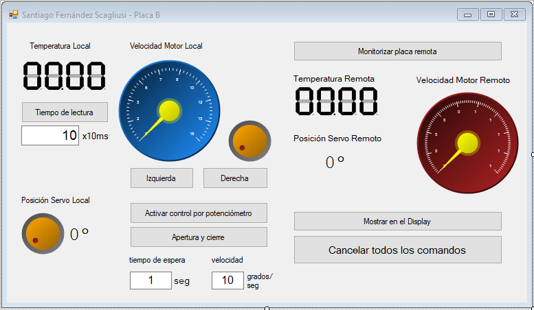

# GUI Controlled Cooling System

- Created a Windows GUI to read data from an LM35 temperature sensor and control servos and stepper motors connected to an STM32.
- Integrated CAN bus to communicate with other STM32 by using the MCP2515 shield.

